# Linux Audio Engine & Realtime Kernel Tuning

> **Target Systems**: Linux (PipeWire 0.3+, JACK2, ALSA)  
> **Key Goal**: Low latency (≤ 5.8 ms roundtrip), zero xruns (buffer underruns), maximum DSP thread efficiency.

This document details the audio engine settings applied by ReaFull to REAPER and the recommended host-level configurations for professional Linux audio workstations.

---

## 1. Overview of the ReaFull Audio Optimization Layer

Achieving reliable low-latency audio on Linux requires coordinating the Linux kernel, audio server (PipeWire/JACK/ALSA), and the DAW's internal threading engine.

ReaFull automates REAPER's internal audio engine parameters while respecting existing custom hardware routing.

```mermaid
graph LR
    subgraph Kernel ["Linux Realtime & System Subsystems"]
        RT_Limits["Realtime Limits (@audio rtprio 95)"]
        MLock["RAM Memlock (unlimited)"]
        Gov["CPU Scaling (performance)"]
    end

    subgraph AudioServer ["Audio Server Layer"]
        PW["PipeWire / JACK2 Engine"]
        ALSA["Direct ALSA Kernel Driver"]
    end

    subgraph REAPER ["REAPER Audio Engine (ReaFull Configured)"]
        Workthreads["workthreads = CPU Cores"]
        MLockAll["linux_mlockall = 1 (Lock buffers in RAM)"]
        RTPrio["alsa_rtprio / jack_rtprio = 90"]
        NoPM["linux_disable_pm = 1 (Disable throttling)"]
        SincHQ["r8brain & 768pt Sinc Resampling"]
    end

    Kernel --> AudioServer
    AudioServer --> REAPER
```



---

## 2. Automated REAPER Audio Engine Parameters

When `audio_tuning` is deployed, ReaFull configures the following low-latency parameters inside `reaper.ini`:

### 2.1 Realtime Scheduling and Memory Locking

| Key | Value | Purpose and Technical Rationale |
| :--- | :--- | :--- |
| `linux_mlockall` | `1` | **Lock physical RAM**: Prevents Linux kernel memory paging from swapping audio buffer pages to disk. Eliminates momentary timing jitter and audio dropouts. |
| `alsa_rtprio` | `90` | **Realtime SCHED_FIFO Priority**: Assigns high realtime priority (90) to the primary audio processing thread, above normal desktop applications. |
| `jack_rtprio` | `90` | Assigns realtime priority (90) for JACK/PipeWire client threads. |
| `linux_disable_pm` | `1` | **Disable Power Management**: Prevents CPU frequency downclocking or deep C-state sleep transitions during active DSP playback. |
| `linux_auto_pasuspend` | `1` | Automatically suspends conflicting legacy PulseAudio server instances when opening direct ALSA devices. |
| `audio_closeifidle` | `0` | Keeps audio hardware streams open when stopped, avoiding re-initialization clicks. |

### 2.2 Thread Allocation and Anticipative DSP

| Key | Value | Purpose and Technical Rationale |
| :--- | :--- | :--- |
| `workthreads` | `CPU_COUNT` | Automatically sets worker threads equal to physical/logical CPU cores for symmetric parallel track rendering. |
| `afx` | `1` | Enables REAPER's Anticipative FX processing engine for non-realtime tracks, freeing RT threads for live inputs. |
| `afxb` | `200` | Sets Anticipative FX render buffer size to 200 ms for maximum plugin stability on dense sessions. |
| `afxrender` | `1` | Enables anticipative processing on track and stem renders. |

### 2.3 Studio High-Precision Resampling

| Key | Value | Mode | Description |
| :--- | :--- | :--- | :--- |
| `playresamplemode` | `5` | **r8brain / 512pt Sinc (HQ)** | Studio-grade real-time sample rate conversion with minimum phase distortion. |
| `projrenderresample` | `6` | **r8brain / 768pt Sinc (Extreme)** | Ultra-clean mastering sample rate conversion for final stem and mix exports. |

---

## 3. Hardware Heuristic Auto-Detection Profiles

During installation, ReaFull checks `aplay -l` for known audio hardware to configure optimal sample rates, bit depths, and block sizes automatically:

### 3.1 Behringer UMC404HD 192k / UMC204HD (`hw:U192k`)
```ini
alsa_indev=hw:U192k
alsa_outdev=hw:U192k
linux_audio_bits=32
linux_audio_bsize=256
linux_audio_bufs=3
linux_audio_nch_in=4
linux_audio_nch_out=4
linux_audio_srate=48000
linux_audio_srateor=1
```
*Roundtrip latency: ~5.3 ms at 48kHz / 256 samples.*

### 3.2 Presonus AudioBox USB (`hw:USB`)
```ini
alsa_indev=hw:USB
alsa_outdev=hw:USB
linux_audio_bits=24
linux_audio_bsize=256
linux_audio_bufs=3
linux_audio_nch_in=2
linux_audio_nch_out=2
linux_audio_srate=48000
linux_audio_srateor=1
```

### 3.3 Generic / Custom Audio Interfaces
If existing audio settings are already defined, ReaFull **preserves** your custom interface names (`alsa_indev`, `alsa_outdev`, `jack_launchcmd`) while injecting the thread and realtime priority optimizations.

---

## 4. Host OS System-Level Configuration (Recommended)

To allow REAPER to take full advantage of realtime priorities and memory locking, configure your Linux host permissions:

### 4.1 Realtime Group Limits (`/etc/security/limits.d/audio.conf`)

Ensure your user is in the `audio` or `realtime` group, and that the following limits are defined:

```ini
# /etc/security/limits.d/99-realtime-audio.conf
@audio   -  rtprio     95
@audio   -  memlock    unlimited
@audio   -  nice      -19
```

Add your user to the group:
```bash
sudo usermod -a -G audio $USER
```

### 4.2 PipeWire Low-Latency Buffer Locking

If using PipeWire (`pipewire-pulse` / `pipewire-jack`), enforce fixed quantum buffer sizes during DAW sessions:

```bash
# Force PipeWire buffer to 256 samples at 48kHz (~5.3ms latency)
pw-metadata -n settings 0 clock.force-quantum 256
pw-metadata -n settings 0 clock.force-rate 48000

# Reset to dynamic automatic mode when finished
pw-metadata -n settings 0 clock.force-quantum 0
```

### 4.3 CPU Frequency Scaling Governor

Ensure CPU cores do not throttle dynamically during audio sessions:

```bash
# Set CPU scaling governor to 'performance' across all cores
echo performance | sudo tee /sys/devices/system/cpu/cpu*/cpufreq/scaling_governor
```
