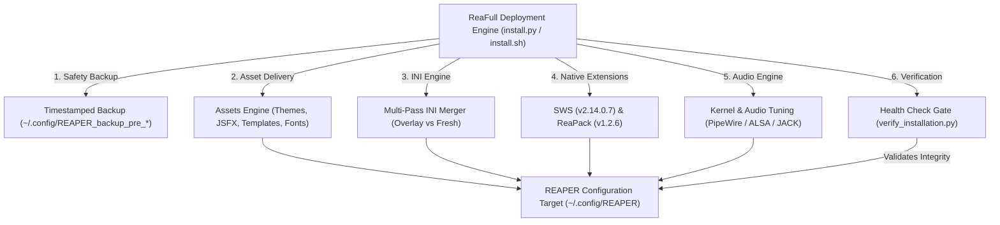

# ReaFull Documentation Wiki

> **Version**: `v2026.3.0`  
> **Status**: Production Ready  
> **Platform**: Linux (x86_64, aarch64) · Native & Flatpak  
> **Host**: Cockos REAPER (v6.x / v7.x)

Welcome to the technical documentation and developer wiki for **ReaFull**, a modular, production-grade workstation suite that transforms Cockos REAPER on Linux into a fully integrated mixing, mastering, and audio production console.

---

## 1. Overview & Vision

ReaFull eliminates the "Linux audio setup tax" by packaging an analog-modeled JSFX console ecosystem, surgical digital DSP, 200+ production track templates, genre-tailored project templates, studio typography, SWS auto-color rules, and automated realtime Linux audio engine optimizations into an atomic, non-destructive deployment engine.

---

## 2. Wiki Navigation & Core Documentation

The wiki is organized into modular guides covering architecture, deployment, audio tuning, plugin DSP catalogs, workflow templates, maintenance, and developer standards:

| Document | Description | Key Topics |
| :--- | :--- | :--- |
| [**System Architecture**](./architecture.md) | Technical design, POSIX sanitization, and ADRs. | INI Merge Engine, Dynamic Template Expansion, Asset CDN, Architecture Decision Records (ADRs). |
| [**Installation & Deployment**](./installation-and-deployment.md) | Comprehensive installation and setup guide. | CLI profiles (`overlay` vs `fresh`), presets (`core`, `full`, `minimal`, etc.), cURL one-liner, headless CI setup. |
| [**Audio Engine & Kernel Tuning**](./audio-engine-tuning.md) | Linux realtime audio stack optimization. | PipeWire / ALSA / JACK setup, thread allocations, `mlockall`, RT priority, HQ Sinc resampling modes. |
| [**DSP Suites Catalog**](./dsp-suites.md) | Complete manual for 50+ bundled JSFX processors. | Analog FX Suite (SolidBus, Pulse-EQ, FET-76, Fat-Tape), Digital FX (D-DynEQ, D-Limit), StripTease MCP Console. |
| [**Templates & Workflows**](./templates-and-workflows.md) | Track templates, project templates, screensets & themes. | 17 TrackTemplate categories (200+ strips), Screensets (`F7`, `F8`, `F9`), Pro/Dark/Gray/Light themes, Typography. |
| [**Backup & Troubleshooting**](./backup-and-troubleshooting.md) | Disaster recovery, maintenance, and diagnostic runbook. | `uninstall.sh` workflow, health check verification, PipeWire buffer lock, xrun debugging, font cache fixes. |
| [**Development Guide**](./development.md) | Contribution guide, repo layout, and toolchains. | Template authoring, validation scripts, build/release asset pipelines, dry-run simulation. |
| [**Git Hygiene & Versioning**](./hygiene.md) | Conventional Commits, branch model, and SemVer. | Commit formatting, `VERSION` file protocol, release tagging, and change hygiene. |
| [**Agent SOP (Standard Operating Procedure)**](./agent-sop.md) | AI Agent operational boundaries and execution laws. | Read-before-write, dry-run validation, context preservation, and build verification gates. |

---

## 3. Key Design Tenets

1. **POSIX Sanitized**: 100% compliant with standard Linux filesystem hierarchies. Zero hardcoded Windows drive letters (`C:\...`) or invalid path separators in config templates.
2. **Non-Destructive by Default (`Overlay` Mode)**: Never overwrites user shortcuts (`reaper-kb.ini`), custom menus (`reaper-menu.ini`), or mouse modifiers (`reaper-mouse.ini`). Merges ReaPack remotes without wiping custom repositories.
3. **Fail-Safe Operation**: Every installation creates an automated timestamped backup before touching target directories.
4. **Hardware-Aware Optimization**: Automatically identifies audio interfaces (e.g. Behringer UMC404HD 192k, Presonus AudioBox) and audio servers (PipeWire, JACK, ALSA) to tune buffer sizes, thread counts, and realtime scheduler priorities.
5. **Verified Integrity**: Bundled extensions (SWS, ReaPack) and remote asset bundles are cryptographically verified using SHA-256 checksums before installation.
