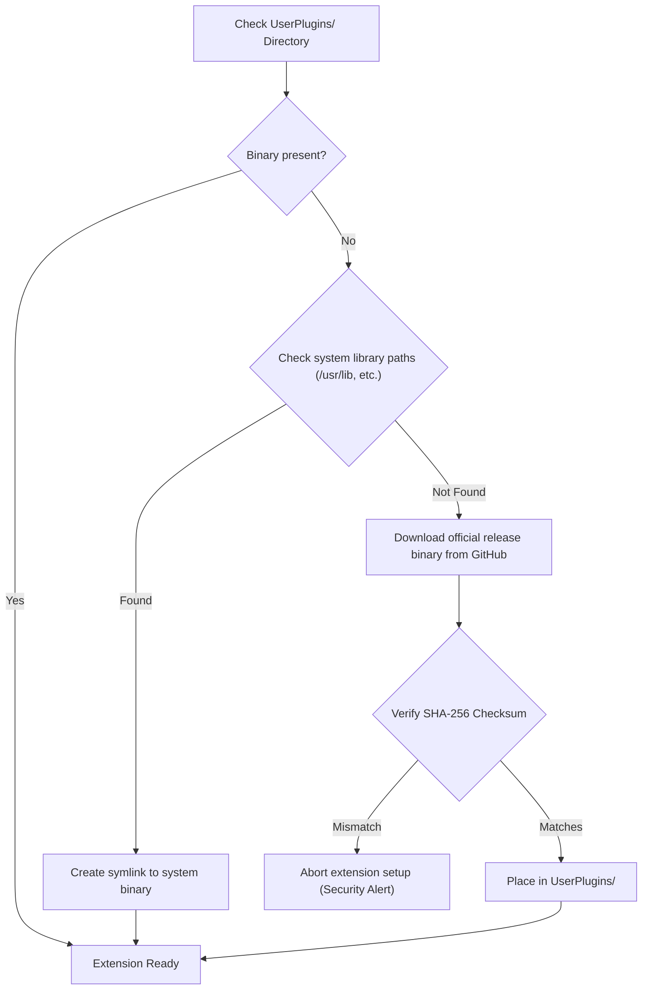

# Installation and Deployment Guide

> **Version**: `v2026.3.0`  
> **Target Environment**: Linux x86_64 / aarch64  
> **Host Requirements**: Cockos REAPER v6.x or v7.x

This document details all deployment workflows for ReaFull, from interactive terminal setups to automated headless pipelines.

---

## 1. System Prerequisites

Before installation, verify the following system packages are available:

| Dependency | Purpose | Minimum Version | Package Name (Debian/Ubuntu) | Package Name (Arch Linux) | Package Name (Fedora) |
| :--- | :--- | :--- | :--- | :--- | :--- |
| **Python 3** | Core installer engine | 3.10+ | `python3` | `python` | `python3` |
| **Fontconfig** | Studio typography registration | Any | `fontconfig` | `fontconfig` | `fontconfig` |
| **cURL / Wget** | Remote asset download | Any | `curl` | `curl` | `curl` |
| **REAPER** | Target Digital Audio Workstation | 6.x / 7.x | [cockos.com](https://www.reaper.fm/) / Flatpak | `reaper` / AUR | Flathub / Tarball |

---

## 2. Quick-Start Workflows

### 2.1 Direct One-Liner (Remote cURL)

The fastest method to deploy ReaFull on a new workstation:

```bash
curl -fsSL https://raw.githubusercontent.com/julesklord/ReaFull/main/install.sh | bash
```

*Note: The script reconnects `/dev/tty` automatically, ensuring the interactive TUI works even when piped through `curl`.*

### 2.2 Git Clone Workflow

For local development or offline installations:

```bash
git clone https://github.com/julesklord/ReaFull.git
cd ReaFull
chmod +x install.sh install.py
./install.sh
```

---

## 3. Installation Profiles: Overlay vs Fresh

ReaFull supports two primary installation profiles:

### 3.1 Overlay Profile (`--profile overlay`) — **Default**

Engineered for users with existing REAPER workflows. It operates non-destructively:
- **Protects**: Keyboard shortcuts (`reaper-kb.ini`), mouse modifiers (`reaper-mouse.ini`), custom toolbars/menus (`reaper-menu.ini`), recent projects list, window states, and existing audio device assignments.
- **Merges**: ReaPack repositories incrementally without deleting existing remotes.
- **Staging**: If a conflict occurs with menu or shortcut files, the ReaFull versions are written as `reaper-menu.ini.reafull` and `reaper-kb.ini.reafull` for manual inspection.

```bash
./install.sh --profile overlay
```

### 3.2 Fresh Studio Profile (`--profile fresh`)

Engineered for fresh operating system installations or complete DAW resets:
- Deploys the complete ReaFull studio configuration.
- Overwrites default menus, toolbars, screensets, and default presets with the ReaFull studio console standards.

```bash
./install.sh --profile fresh
```

---

## 4. Presets and Component Selection

### 4.1 Quick Selection Presets

| Preset Flag | Profile Description | Approx. Download Size | Target Use Case |
| :--- | :--- | :--- | :--- |
| `--preset core` | Core Studio Suite (Themes, Analog/Digital FX, Templates, SWS rules, Typography, Audio Tuning) | **< 700 MB** | Recommended for standard production workstations. |
| `--preset full` | Complete Studio Suite (Everything including third-party and community suites) | **~858 MB** | Full offline master archive. |
| `--preset minimal` | Minimal Studio Core (Themes, Typography, Linux Audio Optimization) | **~20 MB** | Lightweight setup for existing plugin ecosystems. |
| `--preset fx-only` | JSFX Audio FX Suites, Presets & Chains | **~640 MB** | Pure mixing/mastering DSP installation. |
| `--preset themes-only` | Themes, Splash Screen, Icons, SWS AutoColor | **~20 MB** | Visual identity and workflow styling only. |
| `--preset extras` | Community FX Suites (Saike, Sonic Anomaly, Tilr) & extra scripts | **~180 MB** | Supplementary DSP additions. |

Examples:
```bash
# Deploy core suite
./install.sh --preset core

# Deploy only themes and styling
./install.sh --preset themes-only
```

### 4.2 Granular Component IDs

You can supply exact comma-separated component identifiers via `--components`:

```bash
./install.sh --components themes,analog_fx,digital_fx,fonts,audio_tuning
```

Available component identifiers:
- `themes`: ReaFull Pro, Dark, Gray, Light Themes & Splash Screen.
- `analog_fx`: ReaFull Analog FX Suite (SolidBus, DisTres-C, Pulse-EQ, Tape, Tube-Pre, FET-76).
- `digital_fx`: ReaFull Digital FX Suite (D-DynEQ, D-MSComp, D-Meter LUFS, Reflex Reverbs).
- `community_fx`: Saike Tools, Sonic Anomaly, Tilr, Liteon, LOSER, Stillwell, Schwa, Mawi.
- `templates`: 17 TrackTemplate categories (200+ strips) and genre ProjectTemplates.
- `sws_autocolor`: 310+ SWS AutoColor rules, track icons, and HiDPI toolbar icons.
- `menus_toolbars`: Custom toolbars, keymaps, mouse modifiers, screensets.
- `scripts`: FTC Tools, HeDa Track Inspector 2, Lokasenna GUI v2, Zaibuyidao, ReaFull Manager.
- `presets`: Factory analog/digital presets, mastering and mix chains.
- `fonts`: Studio typography installed to `~/.local/share/fonts/ReaFull/`.
- `audio_tuning`: Realtime Linux audio engine and thread optimization.
- `striptease`: StripTease Modular MCP console mixer engine.
- `extensions`: SWS Extension (v2.14.0.7) and ReaPack (v1.2.6) native binary setup.
- `docs`: Embedded offline documentation.

---

## 5. Target Directory Resolution

ReaFull detects existing installations automatically. You can explicitly target Native or Flatpak installations:

```bash
# Native REAPER (~/.config/REAPER)
./install.sh --target native

# Flatpak REAPER (~/.var/app/fm.reaper.Reaper/config/REAPER)
./install.sh --target flatpak

# Custom installation path
./install.sh --target /opt/custom/reaper_config
```

---

## 6. Native Extensions Setup (SWS & ReaPack)

When the `extensions` component is enabled (default in `core` and `full`), ReaFull executes a 3-stage resolution pipeline for SWS and ReaPack:



---

## 7. Command-Line Reference

```
usage: install.py [-h] [--target TARGET] [--profile {overlay,fresh}] [--force]
                  [--all] [--components COMPONENTS]
                  [--preset {full,core,minimal,fx-only,themes-only,community,extras}]
                  [--no-backup] [--allow-running-reaper] [--assets-dir ASSETS_DIR]
                  [--dry-run] [--log-file LOG_FILE] [--quiet] [--version]
```

### Options Description

- `--target TARGET`: Specify destination (`native`, `flatpak`, or `/path/to/dir`).
- `--profile {overlay,fresh}`: Set merge strategy. Default: `overlay`.
- `--force`, `-f`: Overwrite keyboard shortcuts and menus even in overlay mode.
- `--all`, `-a`: Install all components (same as `--preset full`).
- `--preset PRESET`, `-p`: Quick profile selection (`core`, `full`, `minimal`, etc.).
- `--components COMP1,COMP2`: Explicit comma-separated component list.
- `--no-backup`: Skip pre-installation safety backup creation.
- `--allow-running-reaper`: Allow installation while REAPER process is active.
- `--dry-run`: Execute full simulation without modifying files or writing to disk.
- `--log-file PATH`: Custom log file path (defaults to target directory).
- `--quiet`, `-q`: Suppress terminal interactive menus and prompts (ideal for CI/CD).
- `--version`, `-v`: Output installer version and exit.

---

## 8. Unattended & CI/CD Automated Deployments

For headless systems, Docker containers, or automated studio provisioning scripts:

```bash
# Automated non-interactive installation with core preset and dry-run check
python3 install.py --quiet --preset core --target native --dry-run

# Automated real deployment
python3 install.py --quiet --preset core --target native
```
